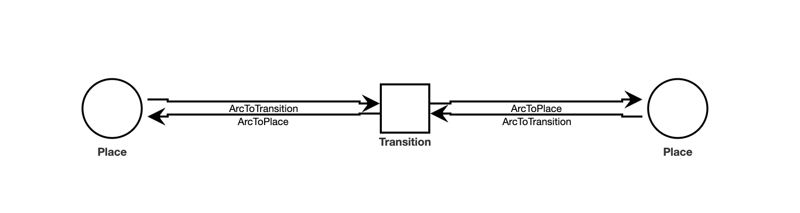
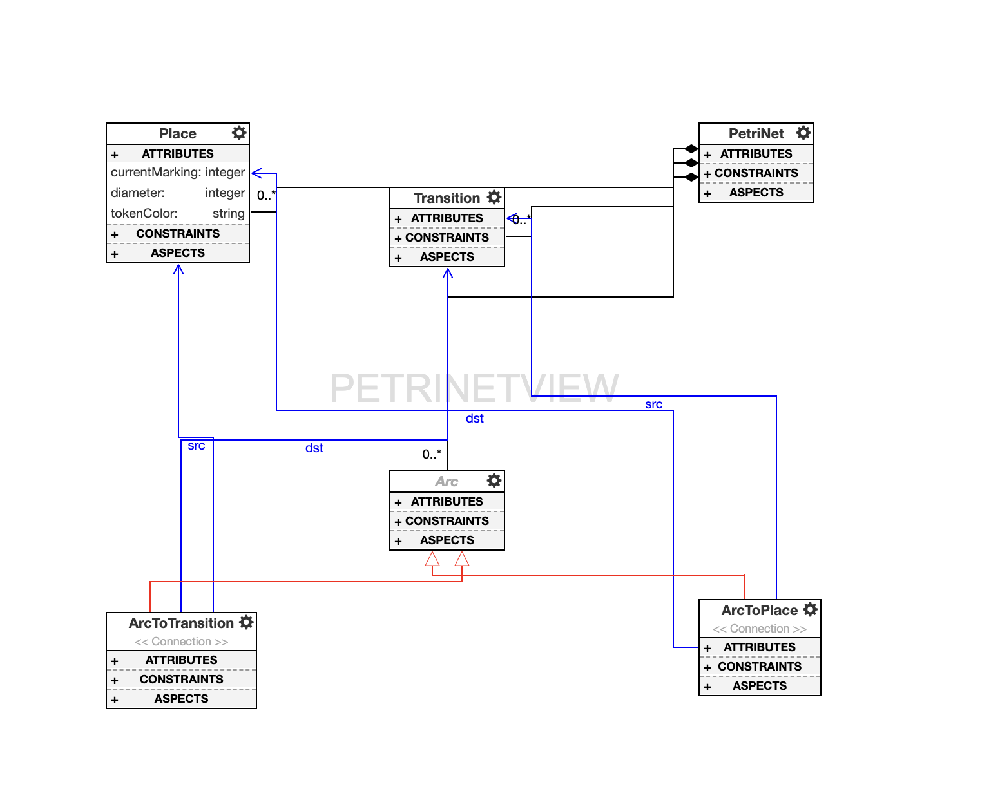
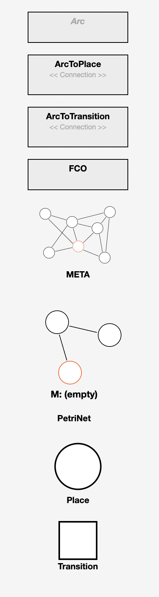

# Petri Net Design Studio

## Explanation

This custom design studio provides a simulator, interpreter, and example of the model for a Petri Net.

**What is a Petri Net?**
A Petri Net is a graphical representation, consisting of a directed bipartite graph, which is made up of two types of elements: places and transitions. Places represent the state of the system, and transitions represent the events or actions that can occur in the system. The places and transitions are connected by arcs, which represent the flow of information or control between them.

**When is a Petri Net useful?**
A Petri Net can be useful to model a complex concurrent or distributed system because it gives a clear vizualization of the state of the system at any given time.

## Installation

First, install the following:

- [MongoDB](https://www.mongodb.com/)
- [NodeJS](https://nodejs.org/en/) (LTS recommended)
- [WebGME CLI](https://github.com/webgme/webgme-cli)

Second, start mongodb locally by running the `mongod` executable in your mongodb installation (you may need to create a `data` directory or set `--dbpath`). Alternatively, you can use MongoDB with Docker, by running the following command:

```bash
docker run --name my-mongo -d -p 27017:27017 mongo:4.4
```

## Usage

Run `webgme start` from the project root to start the project. Finally, navigate to `http://localhost:8888` to start using PetriNetDesignStudio!

## Screenshots





## Future

To complete this design studio, I will be completing the PetriNetVisualizer. Unfortunately, due to family and pet purposes, I was unable to complete the vizualizer to my satisfaction. This vizualizer will allow the user to create a model, and then see the model in action. The vizualizer will be able to show the state of the system at any given time, and will be able to show the flow of information between the places and transitions.
